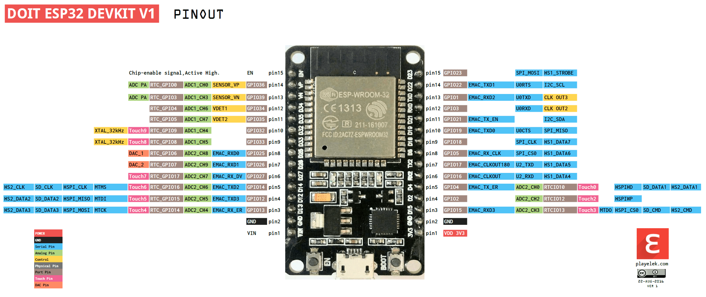

# Hardware
______________

## 3D Model of the board when mounted

______________

The `hardware` folder has all necessary files to produce and mount the hardware part of the project as can be seen on the table below.

|File/Folder                |Function                                                                         |
|---------------------------|---------------------------------------------------------------------------------|
|GERBER                     |Output files to produce the PCB in the factory.                                  |
|3DModel.png                |3D Model picture of the mounted board.                                           |
|BOM.csv                    |Bill of Materials, all components necessary to build the project.                |
|BOM.pdf                    |Bill of Materials, all components necessary to build the project.                |
|Board 3D.pdf               |3D Model picture of the mounted board. Open in Acrobat Reader.                   |
|Drill.Cam                  |Mechanical positioning and sizes of holes in the board in CAM format.            |
|ESP32-pinout-mapping.png   |Pinout of the development board used in the project.                             |
|GERBER.zip                 |Output files to produce the PCB in the factory. The industries accept .zip files.|
|General_Schematic.pdf      |File that shows how the components are connected to each other in the board.     |
|Layers.Cam                 |Mechanical positioning and sizes of all layers in the board in CAM format.       |
|Mechanical Bot Mirrored.pdf|Mechanical designes with sizes and holes distances.                              |
|Mechanical Bot.pdf         |Mechanical designes with sizes and holes distances.                              |
|Mechanical Top.pdf         |Mechanical designes with sizes and holes distances.                              |	

For this specific project we do not have any special part, no SMD nor difficult components to find and use. We have two options when mounting this board, one is to solder the ESP32 Development Board directly to PCB, other is use female headers. The latter is better because it will be possible to remove the board easily if you want to.
It is important to be aware of what model of ESP 32 Development board to use. This project was designed to be compatible with [DoIT ESP32 DevKit V1](https://docs.platformio.org/en/latest/boards/espressif32/esp32doit-devkit-v1.html) with 30 pins (some development boards have more pins). The pinout is shown below:

## BOM

|Designator|Comment                    |Description                        |Quantity|Value |Reference Link                                                          |Datasheet|
|----------|---------------------------|-----------------------------------|--------|------|------------------------------------------------------------------------|---------|
|D1        |Diode                      |Rectifier Diode 1N4007             |1       |1N4007|[1N4007](https://lcsc.com/product-detail/Others_GW-1N4007_C331633.html) |[1N4007](Datasheet/1N4007.pdf)|
|L1        |Red LED                    |5mm Red LED                        |1       |      |[5mm Red LED](https://lcsc.com/product-detail/Others_TOGIALED-TJ-L5FYTGHRMBCSFLC4R-A5_C331027.html)|[5mm Red LED](Datasheet/RED%20LED.pdf)|
|Q1        |Transistor                 |NPN General Purpose Amplifier      |1       |PN2222|[PN2222](https://lcsc.com/product-detail/Transistors-NPN-PNP_ON-Semiconductor-ON-PN2222ATFR_C184875.html)|[PN2222](Datasheet/PN2222.pdf)|
|R1        |Resistor                   |1/4 W Resistor 1K 5%               |1       |1K    |[1K](https://lcsc.com/product-detail/Carbon-Film-Resistors_CCO-Chian-Chia-Elec-CF1-4W-1KR-5-T52_C120055.html)|[1K](Datasheet/1K%201_4W%20Resistor.pdf)|
|R2, R3, R5|Resistor                   |1/4 W Resistor 10K 5%              |3       |10K   |[10K](https://lcsc.com/product-detail/Carbon-Film-Resistors_UNI-ROYAL-Uniroyal-Elec-CFR0W4J0103A50_C61299.html)|[10K](Datasheet/10K%201_4W%20Resistor.pdf)|
|R4        |Resistor                   |1/4 W Resistor 300R 5%             |1       |300R  |[300R](https://lcsc.com/product-detail/Carbon-Film-Resistors_UNI-ROYAL-Uniroyal-Elec-CFR0W4J0301A50_C69881.html)|[300R](Datasheet/300R%201_4W%20Resistor.pdf)|
|RLY1      |Relay                      |5V Relay                           |1       |      |[5V](https://lcsc.com/product-detail/Relays_SRD-05VDC-SL-C_C35449.html)|[5V](Datasheet/5V%20Relay.pdf)|
|S1        |Switch                     |Switch Pushbutton                  |1       |      |[Switch](https://lcsc.com/product-detail/Tactile-Switches_Korean-Hroparts-Elec-K2-6639DP-V4SW-04_C89914.html)|[Switch](Datasheet/Switch%20Pushbutton.pdf)|
|T1        |Terminal                   |3-Way Screw Terminal               |1       |      |[Screw Terminal](https://lcsc.com/product-detail/Screw-terminal_DIBO-DB126V-5-0-3P_C395850.html)|[Screw Terminal](Datasheet/ScrewTerminal.pdf)|
|T2        |JST                        |JST Male Board Connector           |1       |      |[JST Connector](https://lcsc.com/product-detail/Wire-To-Board-Wire-To-Wire-Connector_JST-Sales-America_B2B-XH-2-LF-SN_JST-Sales-America-B2B-XH-2-LF-SN_C158014.html)|[JST Connector](Datasheet/JST%20Connector.pdf)|
|T3,T4     |Not in Schematic (Optional)|Female Pin Header 15x2.54mm (Pitch)|2       |      |[Pin Header](https://lcsc.com/product-detail/Pin-Header-Female-Header_Ckmtw-Shenzhen-Cankemeng-C124408_C124408.html)|[Pin Header](Datasheet/Female%20Pin%20Header.pdf)|
|U1        |ESP32 Dev Kit V1           |DoIT Development board             |1       |      |[ESP32](https://produto.mercadolivre.com.br/MLB-1027131279-esp32-placa-de-desenvolvimento-wifi-bluetooth-esp32s-_JM#position=1&type=item&tracking_id=d3910dcd-3cd6-4bf9-aae8-56e4fdf04bef)|[ESP32](https://github.com/SmartArduino/SZDOITWiKi/wiki/ESP8266---ESP32)|
|U2        |DHT22                      |Temperature and Humidity Sensor    |1       |      |[DHT22](https://produto.mercadolivre.com.br/MLB-1144947807-sensor-de-temperatura-e-umidade-dht22-_JM?quantity=1#position=1&type=item&tracking_id=b7e0d904-1f11-4423-8deb-76ee050d7dd3)|[DHT22](Datasheet/DHT22.pdf)|

## Future Implementations

+ Add [licensing](https://forum.mysensors.org/topic/3096/open-hardware-licensing).
+ Change PTH to SMD components to reduce size.
+ Add LEDs to show operation processes (blink fast when looking for internet connection, blink slow when is working properly, etc).
+ Instead of using DoIT ESP32 DevKit V1 board, put the ESP32 microcontroller directly into PCB.
