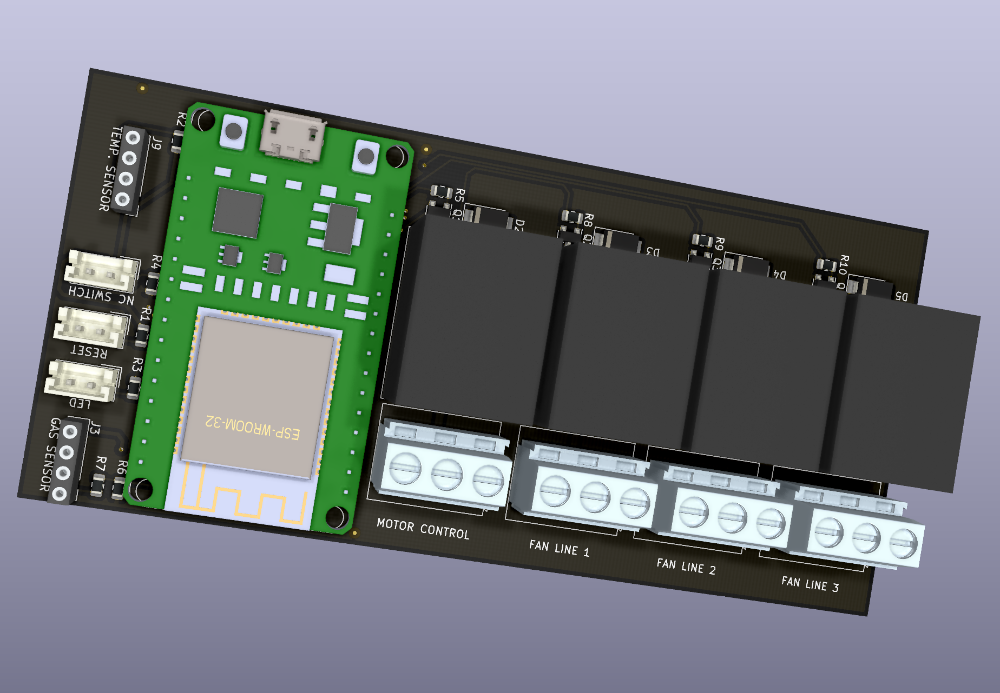
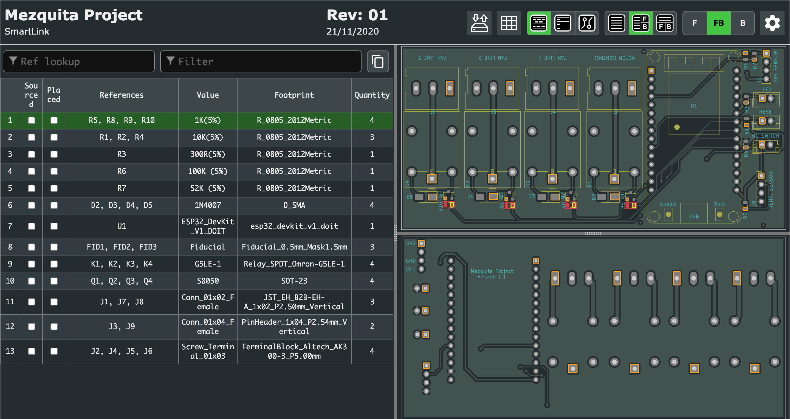

# Hardware V3
______________

## 3D Model of the board when mounted

______________

The `hardware` folder has all necessary files to produce and mount the hardware part of the project as can be seen on the table below.

|File/Folder              |Function                                                                         |
|-------------------------|---------------------------------------------------------------------------------|
|3DModel.png              |3D Model picture of the mounted board.                                           |
|ibom.html                |Bill of Materials, all components necessary to build the project.                |
|ESP32-pinout-mapping.png |Pinout of the development board used in the project.                             |
|gerber.zip               |Output files to produce the PCB in the factory. The industries accept .zip files.|
|Schematic.pdf            |File that shows how the components are connected to each other in the board.     |
|Layout.pdf               |Mechanical design                                                                |

We have two options when mounting this board, one is to solder the ESP32 Development Board directly to PCB, other is use female headers. The latter is better because it will be possible to remove the board easily if you want to.
It is important to be aware of what model of ESP 32 Development board to use. This project was designed to be compatible with [DoIT ESP32 DevKit V1](https://docs.platformio.org/en/latest/boards/espressif32/esp32doit-devkit-v1.html) with 30 pins (some development boards have more pins). The pinout is shown below:

## BOM

[Interactive BOM link](ibom.html)

## Future Implementations

+ Add [licensing](https://forum.mysensors.org/topic/3096/open-hardware-licensing).
+ Add LEDs to show operation processes (blink fast when looking for internet connection, blink slow when is working properly, etc).
+ Instead of using DoIT ESP32 DevKit V1 board, put the ESP32 microcontroller directly into PCB.
